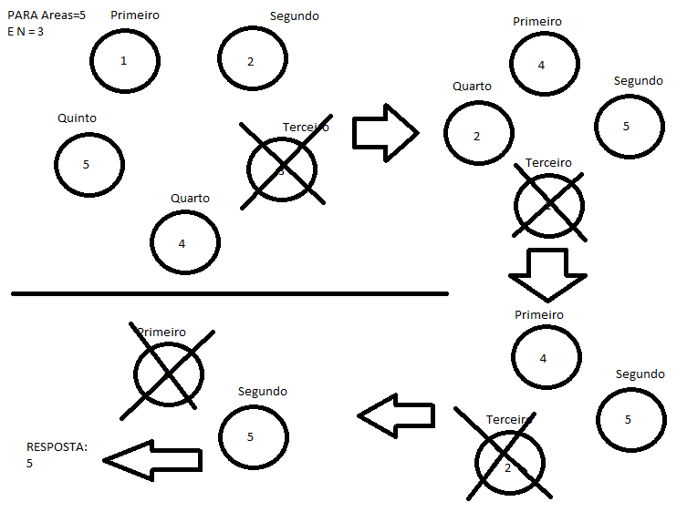

# Problema [1031 - Crise de Energia]()

Durante uma crise de energia na Nova Zelândia no inverno passado (causada por uma escassez de chuva e, consequentemente, por causa dos níveis baixos nas barragens hidrográficas), um esquema de contingência foi desenvolvido para desligar a energia para as áreas do país de forma sistemática, de uma forma totalmente justa. O país foi dividido em N regiões (Auckland seria a região número 1 e Wellington a número 13). Um número, m, seria escolhido randomicamente e a energia deveria ser desligada primeiro na região 1 (claramente o ponto de início mais justo) e então em cada m região após esta, indo de uma a outra região e ignorando as regiões já desligadas. Por exemplo, se N = 17 e m = 5, a energia deverá ser desligada em todas as regiões seguindo a seguinte ordem: 1,6,11,16,5,12,2,9,17,10,4,15,14,3,8,13,7.

O problema é que, claramente seria mais justo desligar a região de Wellington por último (Isso porque é onde a sede da empresa se encontra). Portanto, para um dado N (regiões), o número aleatório m (salto) precisa ser cuidadosamente escolhido de forma que a região 13 seja a última região a ser escolhida.

Escreva um programa que leia o número de regiões e determine o menor número m que assegure que Wellington (região 13) possa continuar funcionando enquanto o resto do país esteja desligado.

### Entrada
A entrada consistirá de uma série de linhas, cada uma contendo o número de regiões N (13 ≤ N ≤ 100 ). O fim da entrada é indicado por uma linha consistindo de um valor zero (0).

### Saída
A saída consistirá de uma série de linhas, uma linha para cada linha de entrada. Cada linha consistirá de um m de acordo com o esquema acima apresentado.

  
Solução 1:

A ideia dessa solução é baseada em um brute force, onde ele vai tentar N tipos de passos diferentes e verificar quem fica no final, se for 13, então ele sai do loop e printa esse N.

Para a implementação do algoritmo que verifica quem ficou no final, se usou um algoritmo recursivo, onde o que ele faz é o seguinte:

- Recebe o input a quantide de areas e um N
- Ele seleciona o N elemento como desligado (Logo não vai ser o ultimo)
- Chama a própria função com o (areas-1) e N, então o valor de retorno X dessa chamada 
- O valor de retorno significa que o ultimo daqueles que sobraram vai ser Xº esimo depois de N que vai ser o ultimo.

Abaixo um desenho para representar mais ou menos a recursão falada:

- [Luiz H. Lago](https://github.com/crazynds)

