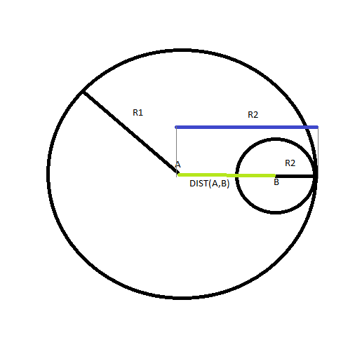

# Problema [1039 - Flores de Fogo](https://www.beecrowd.com.br/judge/pt/problems/view/1039)

Nos dias atuais uma flor de fogo não é algo considerado estranho para muitos jovens.  Isso porque um famoso jogo de videogame popularizou esse tipo de flor. Nesse jogo o protagonista ganhava superpoderes ao tocar em uma flor de fogo, passando a atirar pequenas bolas de fogo para derrotar seus inimigos.

No entanto, já se falava sobre flores de fogo há muito tempo atrás. Na mitologia polonesa, flores de fogo são flores místicas de grande poder guardadas por espíritos malignos. Ela possuía esse nome porque brilhava tanto que era impossível olhá-la diretamente. Quem possuísse uma flor dessas ganharia a habilidade de ler a mente de outras pessoas, encontrar tesouros escondidos e repelir todos os males.

Para obter uma flor de fogo, a pessoa deveria procurá-la em uma floresta antes da meia-noite na véspera do Noc Kupały. Exatamente à meia-noite ela floresceria. Para colhê-la seria preciso desenhar um círculo em volta dela. Parece uma tarefa fácil, no entanto, os espíritos malignos que guardam a flor tentariam de tudo para distrair qualquer um tentando colher a flor. Se a pessoa falhasse ao tentar desenhar um círculo em volta da flor, teria sua vida sacrificada.

Dados dois círculos, um desenhado por um ambicioso caçador de flores de fogo e outro representando a área da flor, sua tarefa é determinar se o caçador morre ou fica rico com sua conquista.

## Entrada
A entrada é composta por diversas instâncias e termina com final de arquivo (EOF). Cada instância consiste em uma linha com seis inteiros, R1 (1 ≤ R1) , X1(|X1|), Y1(|Y1|), R2 (R2 ≤ 1000), X2(|X2|), Y2 (Y2 ≤ 1000). O círculo desenhado pelo caçador possui raio R1 e centro (X1; Y1). O círculo representando a área da flor possui raio R2 e centro (X2; Y2).

## Saída
Para cada instância imprima uma única linha contendo MORTO, se o caçador morre, ou RICO se o caçador consegue colher a flor.

  
Solução 1:

  O design dessa solução foi pensando no seguinte, sendo dois circulos aleatórios, um só estaria dentro de outro totalmente se a distancia do circulo menor B até a borda do circulo maior A tem que ser no mínimo R2 (raio do B), então a distancia entre o ponto de A e o ponto de B deve ser no máximo o R1 (raio de A) menos o R2. Segue imagem ilustrativa abaixo:
  
  

