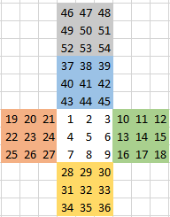

# Problema 1232 - Ciclo de Rubik

## Solução 1:
A ideia dessa solução é por tentativa na força bruta, ou seja, é necessário fazer o movimento dado como input N vezes até chegar na configuração inicial e então printar esse N como a resposta. 
A maneira mais rápida de implementar a movimentação é criar um array no qual contém posições de todas as cores das faces, e atribuir a cada casa uma posição de face conforme a imagem abaixo:



E após isso implementar uma função para cada movimentação, onde em cada função ele especifica a movimentação das casas conforme necessário. Um exemplo de função que implementa movimentação da face F é mostrado abaixo:

```C++
void rota4(char *s,int a,int b,int c, int d){
    char t = s[a];
    s[a] = s[b];
    s[b] = s[c];
    s[c] = s[d];
    s[d] = t;
}

void rotacionaF(char* c){
    rota4(c,0,6,8,2);
    rota4(c,1,3,7,5);

    rota4(c->pos,33,26,38,9);
    rota4(c->pos,34,23,37,12);
    rota4(c->pos,35,20,36,15);
}
```
Outro ponto interessante é que não é necessário implementar a rotação reversa, no caso é só executar a rotação normal 3 vezes que o resultado vai ser o mesmo da rotação reversa. 
